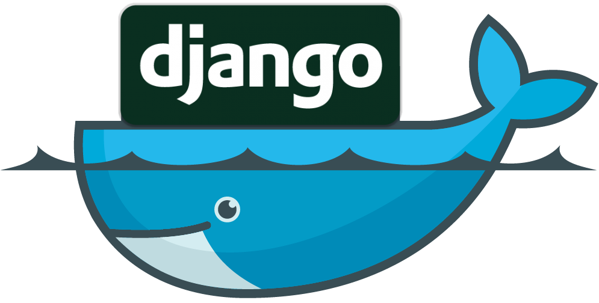



# Django-Docker CLI
[https://ronnasayd.github.io/django-docker/](https://ronnasayd.github.io/django-docker/)

   

System to automatically create development and production environments in django with docker and facilitate the development of applications.

## Required Programs
  - [Python](https://www.python.org/) version 3 or higher
  - [Docker](https://www.docker.com/)
  - [Docker compose](https://docs.docker.com/compose/)

## Installation
Linux:

    sudo apt-get install python3.6
    sudo apt-get install docker.io
    sudo apt-get install docker-compose
    sudo groupadd docker
    sudo usermod -aG docker $USER
    
> Log out and log back in so that your group membership is re-evaluated.

Windows:

> Download and install the binaries of [python](https://www.python.org/downloads/) and [docker toolbox](https://docs.docker.com/toolbox/toolbox_install_windows/)

## How to use

The files (***config.py***, ***pydd.py*** e ***ddo.sh*** ) and the folder (***modules***) should be in the directory of your django project.

Modify the ***config.py*** settings as you wish, and then run the ***ddo.sh*** script. The ***pydd.py*** file will use ***config.py*** settings to mount the desired infrastructure on the system.

The choice of environment between development or production is made by the ***DEBUG*** variable located in the file ***config.py***

## List of commands

    --help | -h : Show help
    --run | -r : Run the application in selected mode
    --make | -m : Enviroment creation mode
    --clear | -c : Delete generated files
    --clear-all | -ca : Delete all files
    --stop | -s : Stop a specific container
    --stop-app | -sap : Stop containers in app network
    --stop-net | -sn : Stop all containers off a network
    --stop-all | -sal : Stop all containers running on docker
    --shell | -sl : Enter container shell
    --status | -st : Show the status of containers
    --command | -cm : Performs a command inside the container
    --net-status | -ns : Show all networks
    --create-su | -csu : Create a new admin user
    --migrate | -mi : Apply migrations in django
    --clear-mig | -cmi : Clear all migrations and __pycache__ folders
    --show-db | -sdb : Show datbases create with django docker
    --clear-db | -cdb : Clear a specific database create with django docker
    --prune | -p : Prune the system
    --show-img | -si : Show the docker images
    --clear-img | -ci : Clear a specific docker image for image_id
    --attach | -att : Attach to a running ambient
    --restart | -res : Restart a container
    --update | -up : Update django docker
    --show-vol | -sv : Show all volumes
    --clear-vol | -cv : Clear a volume
    --django-create-project | -dcp : Create a django project
    --django-create-app | -dca : Create a django app in a django project
    --dbeaver | -dbv : Run a container with Dbeaver database manager (Just in LINUX yet)
    --portainer | -ptn : Run a container with portainer gui manager for docker

## Contributing
 1. Fork it ([https://github.com/Ronnasayd/django-docker/fork](https://github.com/Ronnasayd/django-docker))
 2. Create your feature branch (`git checkout -b feature/fooBar`)
 3. Commit your changes (`git commit -am 'Add some fooBar'`)
 4. Push to the branch (`git push origin feature/fooBar`)
 5. Create a new Pull Request

## License
This project is licensed under the MIT License - see the [LICENSE.md](LICENSE.md) file for details