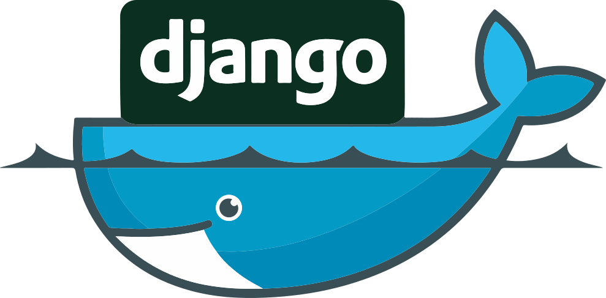

# Django-Docker CLI
[https://ronnasayd.github.io/django-docker/](https://ronnasayd.github.io/django-docker/)

			 								

System to automatically create development and production environments in django with docker and facilitate the development of applications.

## Required Programs
- [Python](https://www.python.org/) version 3 or higher
- [Docker](https://www.docker.com/)
- [Docker compose](https://docs.docker.com/compose/)

## Installation
**Linux:**

    sudo apt-get install python3.6
    sudo apt-get install docker.io
    sudo apt-get install docker-compose
    sudo groupadd docker
    sudo usermod -aG docker $USER
    
> Log out and log back in so that your group membership is re-evaluated.

**Windows:**

> Download and install the binaries of [python](https://www.python.org/downloads/) and [docker toolbox](https://docs.docker.com/toolbox/toolbox_install_windows/)

## How to use

The files *config.py*, *pydd.py*, *ddo.sh*  and the folder *modules* should be in the same directory of your django project. Modify the *config.py* settings as you wish, and then run the *ddo.sh* script with a desirable argument. 

**Variables in config.py:**

*DEBUG (boolean):*	
> When False determines the mode of development and when True mode of production
> 
 *FRONT_DEV_TOOLS (boolean):*   
> When True enables front-end helper tools like gulp and browsersync

*PROJECT_NAME (str):*
> The name of your django project

*PYTHON_VERSION (str):*
> Python version in the container that will run django
  
*WEB_COMMANDS_BUILD (List[str]):*
>  List of shell commands to be added to the container in build

*DATABASE_IMAGE (str):*
> The database container image when it is used

*options:*
>  - postgres
>  - mysql
>  - oracle
>  - mongo

*DATABASE_EXTERNAL (boolean):*
> When true enable django communication with an external database

*DATABASE_DEFAULT_ENVIROMENTS (Dict[str]):*

> - DATABASE_USER : username of the database
> - DATABASE_USER_NAME : environment variable that represents the user in the database container (ex: POSTGRES_USER)
>  - DATABASE_PASSWORD : the password of the database
>  - DATABASE_PASSWORD_NAME :  environment variable that represents the password in the database container (ex: POSTGRES_PASSWORD)
>  - DATABASE_DB : name of the database
>  - DATABASE_DB_NAME : environment variable that represents the name of  the database container (ex: POSTGRES_DB)
>  - DATABASE_PORT : the port operation of the database
>  - DATABASE_HOST : host of a external database (just use in external database)
>  
*DATABASE_OTHERS_ENVIROMENTS (Dict[str]):*
> The first term represents the name of the environment variable to be
> added in the database container and the second term its respective
> value ex('HOME_ENV': '/home')

*DATABASE_ROOT (Dict[str]):*

> -  DESTINATION : The folder where the database will be stored in the container ex:(/var/lib/postgresql/data)
> 
*options:*
> 
>  - /var/lib/postgresql/data
>  - /var/lib/mysql
>  - /var/lib/mongodb

*DATABASE_ENGINE (str):*
> The django database engine ex(django.db.backends.postgresql_psycopg2)

*options:*

>  - django.db.backends.mysql
>  - django.db.backends.oracle
>  - django.db.backends.postgresql_psycopg2
>  - django.db.backends.sqlite3

*WEB_PORT (str):*
> Port where the django application will run (default: 8000)

*NGINX_PORT (str):*
> The port where the nginx will run in production mode (default: 80)

*DATABASE_EXTERNAL_PORT (str):*
> External port for communication with the database in case of conflict

*WEB_ENVIROMENT (Dict[str]):*
> The first term represents the name of the environment variable to be
> added to the container with Django the second term its value

*CONTAINERS List(str):*
> List with optional containers to be added to the environment. (the
> containers must have the same name of their respective images ex:
> redis)

*DOCKER_COMPOSE_VERSION (str):*
> Version of your docker-compose to be added to the generated yml files
> at run time

*NETWORK_NAME (str):*
> Name of the internal network created by the docker that will contain
> all the containers of the environment

*FOLDER_TO_SAVE (str):*
> Directory where the necessary files will be generated at runtime

*ENABLE_HTTPS (boolean):*
> When is True enable https with let's encrypt in production

*SERVER_NAMES (List[str]):*
> The list of dns names to pass to let's encrypt certificates

*NUMBER_WEB_INSTANCES (int):*
> The number of containers with application running in production

 **Make Enviroment:**

    bash ddo.sh --make

 **Run Enviroment:**

    bash ddo.sh --run

## List of Arguments
| Argument |Abbreviation  |Explanation|
|--|--|--|
 --help                     |      -h       | Show help
  --run                      |      -r       | Run the application in selected mode
  --make                     |      -m       | Enviroment creation mode
  --clear                    |      -c       | Delete generated files
  --clear-all                |      -ca      | Delete all files
  --stop                     |      -s       | Stop a specific container
  --stop-app                 |      -sap     | Stop containers in app network
  --stop-net                 |      -sn      | Stop all containers off a network
  --stop-all                 |      -sal     | Stop all containers running on docker
  --shell                    |      -sl      | Enter container shell
  --status                   |      -st      | Show the status of containers
  --command                  |      -cm      | Performs a command inside the container
  --net-status               |      -ns      | Show all networks
  --create-su                |      -csu     | Create a new admin user
  --migrate                  |      -mi      | Apply migrations in django 
  --clear-mig                |      -cmi     | Clear all migrations and __pycache__ folders
  --show-db                  |      -sdb     | Show datbases create with django docker
  --clear-db                 |      -cdb     | Clear a specific database create with django docker
  --prune                    |      -p       | Prune the system
  --show-img                 |      -si      | Show the docker images
  --clear-img                |      -ci      | Clear a specific docker image for image_id
  --attach                   |      -att     | Attach to a running ambient
  --restart                  |      -res     | Restart a container
  --update                   |      -up      | Update django docker
  --show-vol                 |      -sv      | Show all volumes
  --clear-vol                |      -cv      | Clear a volume
  --django-create-project    |      -dcp     | Create a django project 
  --django-create-app        |      -dca     | Create a django app in a django project
  --dbeaver                  |      -dbv     | Run a container with Dbeaver database manager (Just in LINUX yet)
  --portainer                |      -ptn     | Run a container with portainer gui manager for docker 
  --loadtestdata             |      -ltd     | Generate random test data in the database
  --get-certs                |      -gtc     | Get certifies from https letsecnrypt
  --install                  |      -i       | Install python module
  --uninstall                |      -u       | Uninstall python module

## Commands Examples

      bash ddo.sh --run
      bash ddo.sh --make
      bash ddo.sh --clear
      bash ddo.sh --clear-all
      bash ddo.sh --stop web
      bash ddo.sh --stop-app
      bash ddo.sh --stop-net network_example
      bash ddo.sh --shell web
      bash ddo.sh --status
      bash ddo.sh --net-status
      bash ddo.sh --command web 'python manage.py migrate'
      bash ddo.sh --create-su
      bash ddo.sh --migrate # migrate in all models
      bash ddo.sh --migrate django_docker_app # migrate specific model
      bash ddo.sh --clear-mig
      bash ddo.sh --show-db
      bash ddo.sh --clear-db djangodocker_database
      bash ddo.sh --prune
      bash ddo.sh --show-img
      bash ddo.sh --clear-img 627c27fc5060
      bash ddo.sh --attach
      bash ddo.sh --restart web
      bash ddo.sh --update
      bash ddo.sh --show-vol
      bash ddo.sh --stop-all
      bash ddo.sh --django-create-project django_docker_example
      bash ddo.sh --django-create-app main
      bash ddo.sh --dbeaver
      bash ddo.sh --portainer
      bash ddo.sh --loadtestdata django_docker_app.DDuser:10
      bash ddo.sh --get-certs
      bash ddo.sh --install celery
      bash ddo.sh --uninstall celery 

  
## Contributing
1. Fork it ([https://github.com/Ronnasayd/django-docker/fork](https://github.com/Ronnasayd/django-docker))
2. Create your feature branch (`git checkout -b feature/fooBar`)
3. Commit your changes (`git commit -am 'Add some fooBar'`)
4. Push to the branch (`git push origin feature/fooBar`)
5. Create a new Pull Request

## License
This project is licensed under the MIT License - see the [LICENSE.md](LICENSE.md) file for details